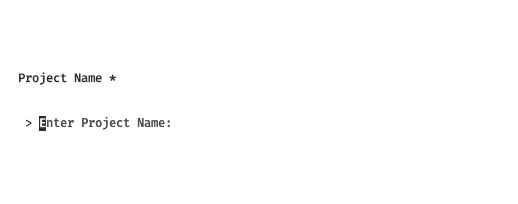
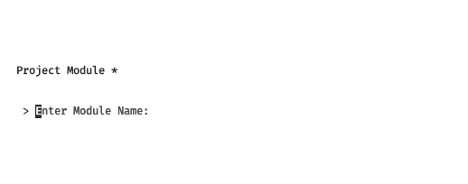
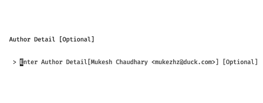
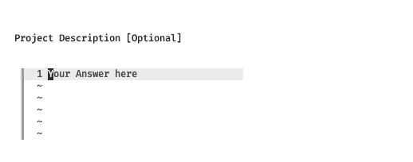
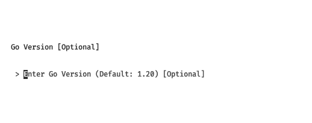
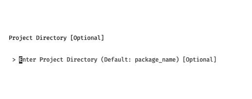
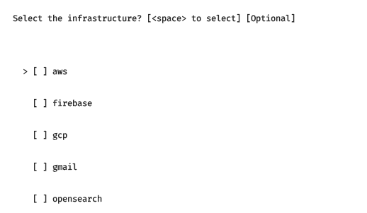

# How to use?

## Generate a project

In order to generate a project you need to enter the following command:
```bash
geng new
```

Once you enter the command it will ask you bunch of questions.

- To enter Project Name *

- To enter Project Module * 

- To enter Author Detail [Optional] 

- To enter Project Description [Optional] 

- To enter Go Version [Optional] 

- To enter Project Directory [Optional] 

- To Select the infrastructure? **Use Space key to Select** [Optional] 


### After filling all question you will get following output
```bash

            GENG: GENERATE GOLANG PROJECT

         ██████╗ ███████╗███╗   ██╗       ██████╗ 
        ██╔════╝ ██╔════╝████╗  ██║      ██╔════╝ 
        ██║  ███╗█████╗  ██╔██╗ ██║█████╗██║  ███╗
        ██║   ██║██╔══╝  ██║╚██╗██║╚════╝██║   ██║
        ╚██████╔╝███████╗██║ ╚████║      ╚██████╔╝
         ╚═════╝ ╚══════╝╚═╝  ╚═══╝       ╚═════╝ 
                                                                                          


        The information you have provided:

        Project Name        💻: Todo App       
        Project Module      📂: github.com/mukezhz/todo
        Project Description 📚:                
        Go Version          🆚: 1.20           
        Author Detail       🤓:                

        💻 Change directory to project:
            cd todo_app

        💾 Initalize git repository:
            git init

        📚 Sync dependencies:
            go mod tidy

        🕵 Copy .env.example to .env:
            cp .env.example .env

        🏃 Start Project 🏃:
            go run main.go app:serve

        Thank You For using 🙏🇳🇵🙏:
```

### Entered value

Here I have entered the following value:
1. project name: todo app
2. go module name: github.com/mukezhz/todo
3. author detail: [just pressed enter ie. empty]
4. project description: [just pressed enter ie. empty]
5. go version: [just pressed enter ie. empty]
6. project directory: [just pressed enter ie. empty]
7. select infrastructure: [just pressed enter ie. empty]

**Note:** You can fill the optional value

:tada: Now follow the instruction and run the project